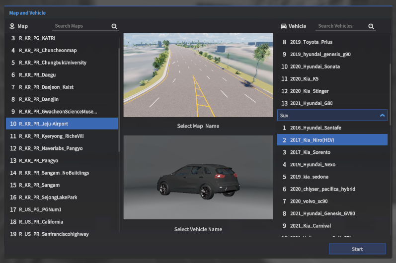
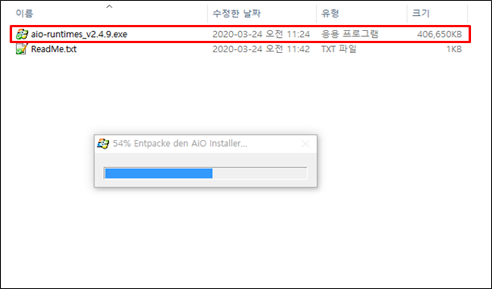

# MORAI SIM 실행하기
MORAI SIM 실행 순서 및 방법에 대하여 설명합니다.

---

## Step 1: 런처 다운로드
아래 경로에서 사용자 운영체제에 맞는 MORAI SIM 런처 프로그램을 다운로드합니다.

 - **[Windows](https://develop-morai-s3-bucket.s3.ap-northeast-2.amazonaws.com/Asset/Launcher/Stage/MoraiLauncher_Win.zip){:target="_blank"}**
 - **[Linux](https://develop-morai-s3-bucket.s3.ap-northeast-2.amazonaws.com/Asset/Launcher/Release/MoraiLauncher_Lin.zip){:target="_blank"}**

<br>

## Step 2: 런처 실행
사용자 운영체제 환경에 맞추어 다운로드한 런처를 실행합니다.
    
### 윈도우에서 런처 실행
런처 프로그램의 압축 해제 후 `MoraiLauncher_Win.exe` 실행합니다.
{:onclick="window.open(this.src)" title="Click view screen"}

### 리눅스에서 런처 실행
런처 프로그램의 압축 해제 후 아래와 같이 런처를 실행합니다.

{:onclick="window.open(this.src)" title="Click view screen"}

런처 실행 파일에 대하여 권한 부여 및 실행
``` shell
$ chmod +x MORAISim.sh
$ chmod +x MoraiLauncher_Lin.x86_64
$ ./MORAISim.sh

```
<br>
## Step 3: 런처 로그인 
런처 실행 화면에서 모라이 라이선스 부서로부터 안내 받은 ID와 PW를 기입 후 **SIGN IN** 을 클릭합니다.
   
{:onclick="window.open(this.src)" title="Click view screen"} 

???+ success
     런처가 정상적으로 실행하면 런처 실행 화면 좌상단에서 ‘MSC is Connected’ 메시지를 확인할 수 있습니다.

<br>
## Step 4: 시뮬레이터 설치 및 업데이트
런처에 로그인하면 화면 좌측 메뉴에 사용자 라이선스에 할당된 시뮬레이터가 버전 별로 표시됩니다. 
실행하고자 하는 시뮬레이터 버전 선택 후 화면 우측하단의 **Install** 을 클릭하여 설치합니다.

{:onclick="window.open(this.src)" title="Click view screen"}

???+ tip
    이전에 설치한 버전에 대해서는 클릭하면 **Install** 대신  **Delete** / **Start** 버튼이 표시됩니다. <br>동일한 시뮬레이터 제품에 대해 새 버전이 출시되면 좌측 상단의 **Latest Version** 항목 하위에 해당 버전이 표시욉니다. 새 버전을 실행하고자 할 경우, 해당 버전명을 선택 후 **Install** 을 클릭하여 버전 업데이트를 진행합니다.

???+ warning
    시뮬레이터를 설치하는 동안 현재 런처 실행 화면을 닫지 않습니다.

    {:onclick="window.open(this.src)" title="Click view screen"}

<br>
## Step 5: 시뮬레이터 시작
1] 시뮬레이터 설치가 완료되면 화면 우측 하단에 **Start** 가 표시됩니다.  **Start** 를 클릭하여 설치한 시뮬레이터를 시작합니다.

{:onclick="window.open(this.src)" title="Click view screen"}
<br>

2] **Map and Vehicle** 화면에서 사용할 맵과 차량 모델을 선택 후 시뮬레이터를 실행합니다.

{:onclick="window.open(this.src)" title="Click view screen"}


???+ tip
    선택할 수 있는 맵과 차량 모델은 사용자 시뮬레이터 제품 도메인 및 버전 마다 상이합니다.

<br>
## [참고하기] 시뮬레이터 실행 이슈
윈도우 및 리눅스에서 시뮬레이터 실행 시 발생하는 이슈를 아래와 같이 해결합니다.

### For Windows
윈도우에 적합한 `Visual C++ Runtime`이 설치되지 않으면 시뮬레이터가 정상적으로 실행되지 않을 수 있다.
해당 경우, 아래와 같이 해결한다.

1. [All in One Runtimes](https://www.computerbase.de/downloads/systemtools/all-in-one-runtimes/){:target="_blank"}를 다운로드한다.

2. `aio-runtimes_v2.4.9.exe` 를 실행한다.
   
    {:onclick="window.open(this.src)" title="Click view screen"}

3. 특정 체크 박스 선택 후, **Installieren**(독어로 설치를 의미)을 클릭한다.
    {:onclick="window.open(this.src)" title="Click view screen"}

4. 설치 완료 후, 시뮬레이터를 재실행한다.

<Br>

### For Linux
그래픽 드라이버 실행 관련하여 아래와 같이 해결한다.

1. 아래 명령어 실행 후 리스트가 출력되면 `nouveau`가 설치된 것이다. NVIDIA 정식 드라이버 설치를 위해 제거한다.

    ```
    $ lsmod | grep nouveau
    ```

2. 아래 경로에 `blacklist` 파일을 생성한다. (아래 두 가지 방법 중 하나 선택)
    ```
    $ sudo vi /etc/modprobe.d/blacklist-nouveau.conf
    ```
    or
    ```
    $ sudo gedit /etc/modprobe.d/blacklist-nouveau.conf
    ```

3. 생성된 `.conf` 파일에 아래와 같이 입력한 후 저장한다.
    ```
    blacklist nouveau
    options nouveau modset=0
    ```
4. 아래 명령어를 실행하여 재부팅한다.
    ```
    $ sudo update-initramfs -u
    $ sudo reboot
    ```

5. 우분투에서 기본으로 제공하는 `X windows` 환경을 종료하고 Console 모드로 들어간다.
    - Ubuntu 18.04
    ```
    $ sudo service gdm stop
    ```

    - Ubuntu 16.04
    ```
    $ sudo service lightdm stop
    ```

6. 우분투 드라이버를 repository에 등록한 후 재부팅한다.
    ```
    $ sudo add-apt-repository ppa:graphics-drivers/ppa
    $ sudo apt update
    $ sudo ubuntu-drivers autoinstall
    $ sudo reboot
    ```

7. 재부팅 후에 아래 명령어로 NVIDIA driver 설치 여부를 확인한다.
    ```
    $ nvidia-smi
    ```

8. `Vulkan`을 설치한 후 시뮬레이터를 재실행한다.
    ```
    $ sudo apt-get install libvulkan1
    ```
