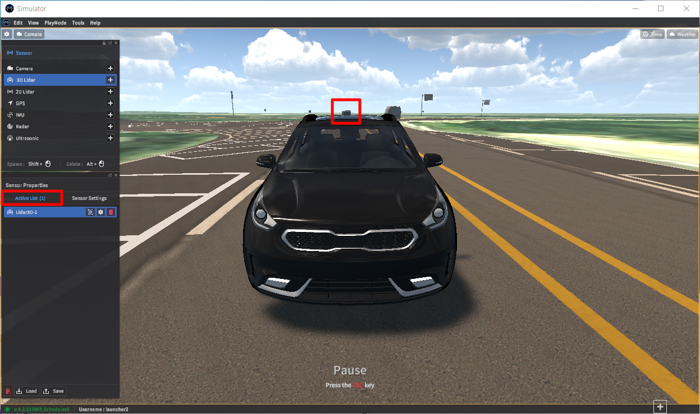

# 기본 사용법

**센서 설정(Sensor Edit Mode)** 에서 센서를 장착(추가) 및 제거, 설정하는 방법을 설명합니다.

---

## Sensor Edit Mode 접근
Ego 차량에 센서를 장착 및 설정하려면 아래와 같이 상단 툴바에서 **Edit > Sensor > Sensor Edit Mode (단축키 F3)** 를 클릭합니다.

<figcaption>
<b>그림 1. Sensor Edit Mode 경로</b>
</figcaption>

아래와 같이 Ego 차량 좌측의 센서 설정창에서 원하는 센서를 장착 및 설정할 수 있습니다.

## 센서 장착 및 추가
**1]** 센서 설정창에서 센서 종류를 선택 후 `Shift` 키를 누른 상태에서 장착하고자 하는 차량 위치에 마우스 클릭합니다.

**2]** 아래와 같이 장착 위치에 센서 좌표가 생기는 동시에, 하단에 해당 센서 설정을 위한 센서 속성창(**Sensor Properties**)이 나타납니다.

장착한 센서의 종류는 **Sensor Properties** > **Active List** 탭에서 확인할 수 있습니다. 

다른 종류의 센서를 추가할 경우 위 **1], 2]** 과정을 반복합니다.

## 센서 제거
장착한 센서는 아래와 같은 방법 중 하나로 제거할 수 있습니다.

- **Sensor Properties > Sensor Settings** 에서 **Delete** 클릭 
  {:onclick="window.open(this.src)" title="Click view screen" width="300px"}

-	**Sensor Properties > Active List** 에서 해당 센서에 대한 **휴지통 아이콘** 클릭
  

## 센서 설정
아래와 같은 **Sensor Properties > Sensor Settings** 탭에서 장착한 센서에 대한 입력 파라미터를 설정합니다. 

 
아래의 방법 중 하나로 장착한 센서에 대한 **Sensor Settings** 으로 이동합니다.

- **Sensor Settings** 의 좌측 패널에서 장착한 센서와 매칭하는 아이콘 클릭
  {:onclick="window.open(this.src)" title="Click view screen" width="300px"}

- **Sensor Properties > Active List** 에서 해당 센서에 대한 **설정 아이콘 (⚙️)** 클릭
  {:onclick="window.open(this.src)" title="Click view screen" width="500px"}

각 센서 별 **Sensor Settings** 에서는 센서의 장착 위치 및 회전각, 센서 모델, 검출 데이터 형식(Groud Truth), 네트워크 등을 설정합니다. 
